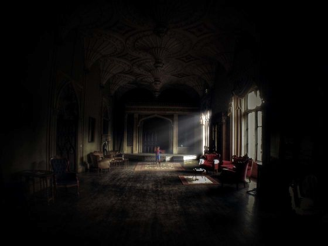
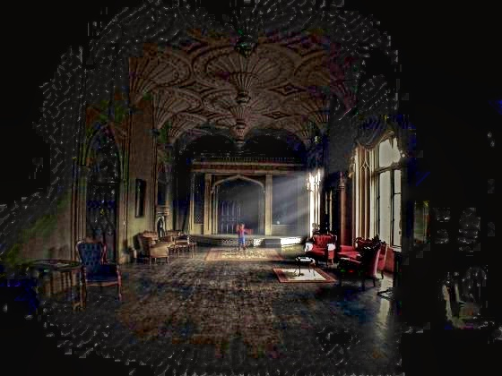
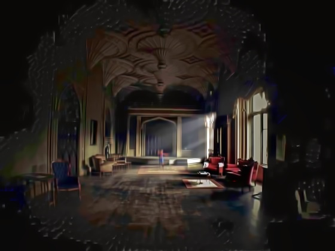
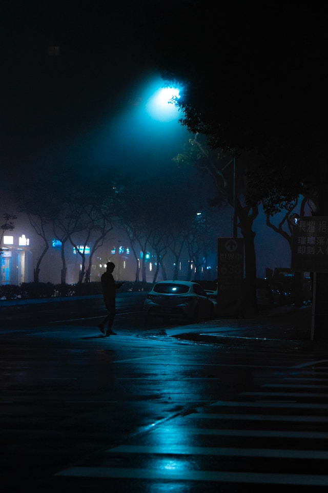
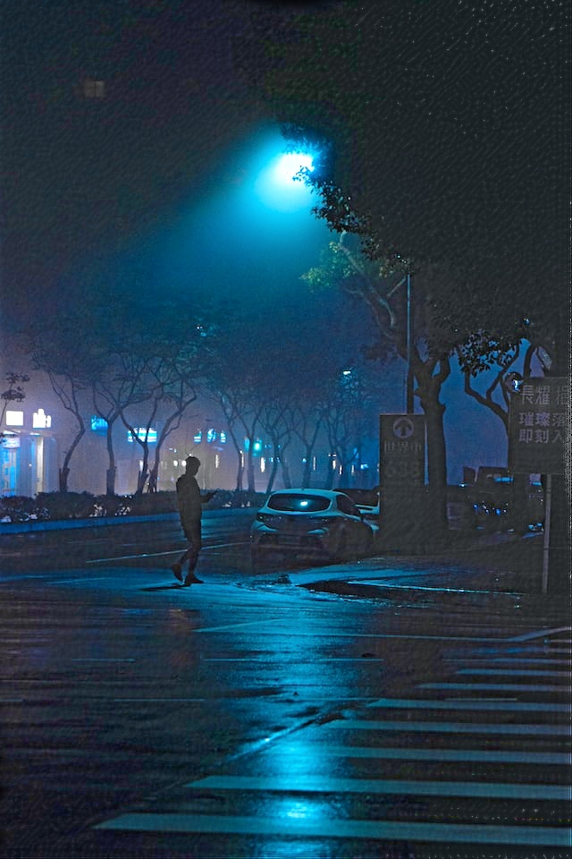
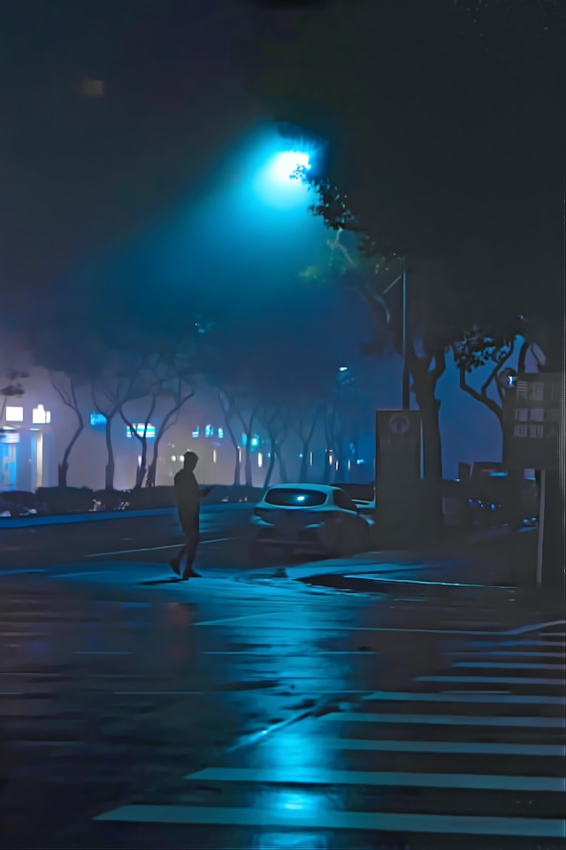

### Introduction - DUAL-CuPy

We aim to create a DUAL package for LLIE in GPU. 

This project is a modification from the original repository: 
https://github.com/Henry-GongZY/Low-light-Image-Enhancement

All codes in numpy are converted to cupy to make use of the CUDA GPU resources. 

It implements the papers:

 * Dual Illumination Estimation for Robust Exposure Correction [[link](https://arxiv.org/pdf/1910.13688.pdf)]
 * LIME: Low-light Image Enhancement via Illumination Map Estimation [[link](https://ieeexplore.ieee.org/document/7782813)]


## 1. Requirements

The project was tested on 
* python>=3.8
* CUDA == 11.4
* CuPy == 10.4.0

The preferred way to manage the packages is through conda. In that way, you dont have to install cudatoolkit, cutensor, and nccl separately. 

Create conda environment 

```bash
conda create -n cupyenv python=3.8 
conda activate cupyenv
conda install -c conda-forge cupy cudatoolkit=11.4
conda install -c conda-forge cupy cudnn cutensor nccl
conda install -c anaconda scikit-image
conda install -c conda-forge opencv
pip install bm3d

```

OR you can also use our conda environment file. 

```bash
conda env create -f environment.yml
```


### 2. To run the script 

| Arguments        | Description |  
| ------------- | ------------- |
| --i        | (Input) Path to folder containing images to process |  
| --bm3d        | (Input) Flag to indicate that you wish to use bm3d to process the DUAL output |  
| --o       | (Output) Path to store enhanced images |
| --dual        | (Input) Flag to indicate that we want to store the DUAL output. Only can be activated if bm3d is activated. Else DUAL is stored by default if bm3d is not activated.  |  


For example:

To run with bm3d filtering:

```bash
python batchEnhancement.py --i input --bm3d
```

To run without bm3d filtering:

```bash
python batchEnhancement.py --i input
```

### Example Output

| Low light image  | Output of DUAL  | Output of BM3D |
|:-------------------------:|:-------------------------:|:-------------------------:|
|   |   | 
|  |  |  


